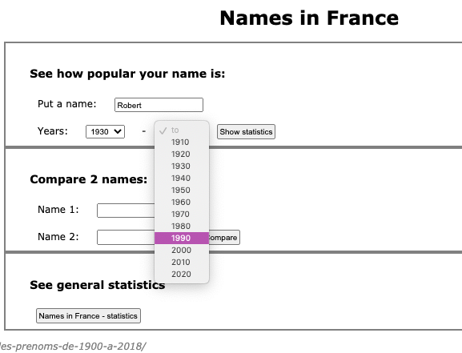
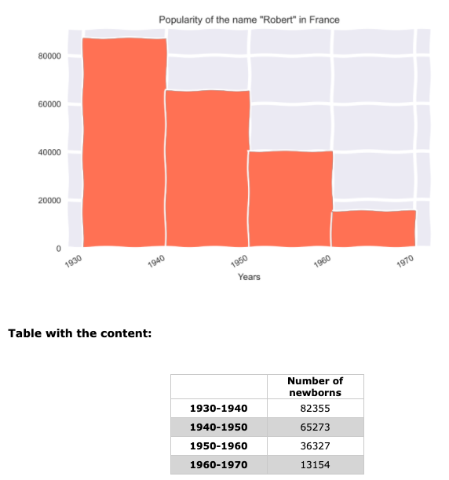
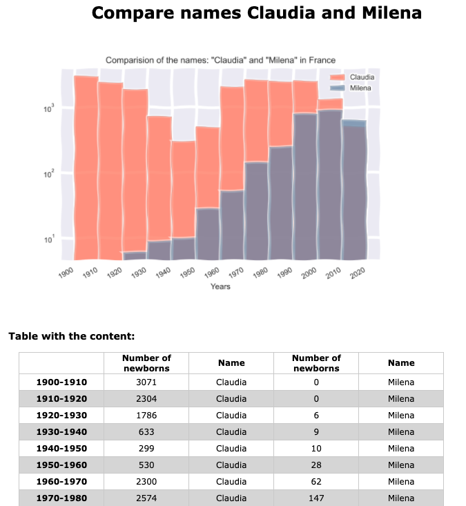
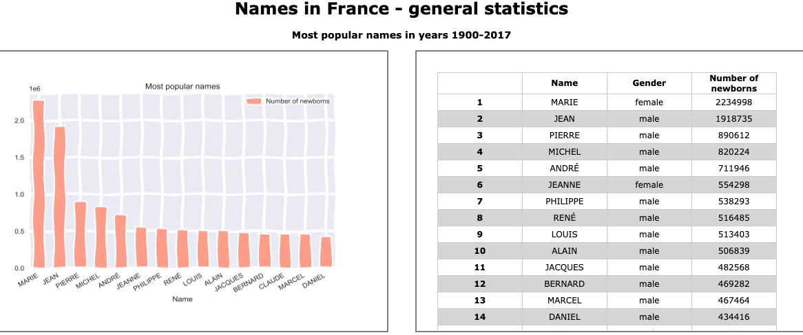

# Names in France

## General info
This app allows you to check the popularity of the default name in France in years 1900-2017. \
You can also compare the popularity of two default names. \
The last section allows you to see the collection with general statistics regarding names in France. \
 \
Data source: https://www.data.gouv.fr/en/datasets/ficher-des-prenoms-de-1900-a-2018/

## Table of contents
* [Screenshots](#screenshots)
* [Setup](#setup)
* [Usage](#usage)
* [Owner](#owner)
* [License](#license)

## Screenshots

### Popularity of a single name

### Two names comparision

### General statistics


## Setup
### Clone the source:

```shell
$ git clone https://github.com/milenakowalska/dict_project
$ cd Names_France
```
### Install packages

```shell
$ pip install requirements.txt
```
### Run and open the app

#### Open the main App:

Run the code in terminal:

```shell
$ python main.py
```
Open the app in browser using http://localhost:5000/

#### Open code of "General statistics" using Jupyter notebook:

```shell
$ jupyter notebook
```
After opening Jupyter Notebook in your browser, choose the file 'Names.ipybn'

## Usage
1. Put a word in the text field and select the date range in years. Click the "Show statistic" button to see the histogram and the table with data content.

2. Compare names: put names in 2 text fields and click the "Compare" button.

3. Click the "Names in France - statistics" button to see other diagrams and dataframes.

All statistics from the 1. and 2. section will be saved for 30 minutes in your local 'static' directory.

## Owner
Created by milenakowalska.

## License
[](http://badges.mit-license.org)

- **[MIT license](http://opensource.org/licenses/mit-license.php)**
